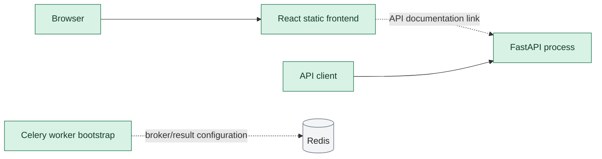
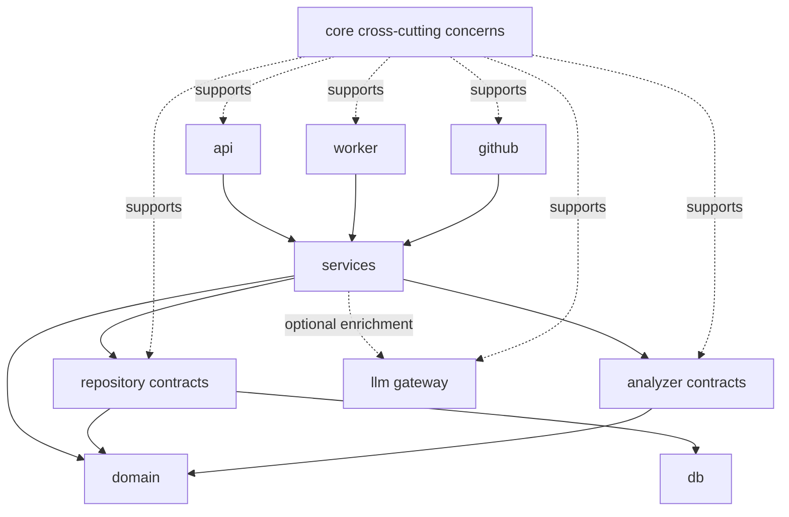

# CodePilot Architecture

CodePilot is a monorepo for an evidence-first code intelligence platform. The current implementation is a foundation: it provides API, worker, frontend, packaging, and container bootstraps. Repository ingestion, persistence, analysis, dashboards, GitHub integration, and AI enrichment are future phases.

> Status snapshot: 2026-08-03. "Reserved" below means that a package boundary exists, but its product behavior has not been implemented.

## Architecture At A Glance

| Area | Implemented baseline | Not implemented yet |
|---|---|---|
| Backend API | FastAPI application factory, `GET /health`, and `GET /api/v1/` discovery | Repository, analysis, finding, graph, risk, and integration endpoints |
| Worker | Importable Celery application with environment-based Redis broker and result-backend URLs | Tasks, analysis orchestration, retries, and persisted task state |
| Frontend | React/Vite landing page with a configurable link to the API documentation | Product dashboard, routing, API data flows, and analysis views |
| Persistence | SQLAlchemy, async PostgreSQL, and Alembic dependencies are declared; Compose provisions PostgreSQL locally | Engine/session setup, models, repositories, and migrations |
| Analysis | The `analyzers` boundary is reserved | Analyzer contracts, tools, metrics, findings, graphs, hotspots, and risk scoring |
| Integrations | The `llm` and `github` boundaries are reserved | Provider adapters, AI enrichment, GitHub App, webhooks, and pull-request analysis |

## Monorepo Structure

```text
codepilot/
|-- backend/                  Python backend package and tests
|   |-- src/codepilot/        Runtime source and package boundaries
|   `-- tests/                API and Celery bootstrap tests
|-- frontend/                 React and TypeScript application
|   `-- src/                  Current landing page and styles
|-- docs/                     Architecture decisions and project documentation
|   `-- adr/                  Architecture Decision Records
|-- prompts/                  Sequenced implementation prompts for phases 1-15
|-- openspec/                 Specification-driven development context
|-- ROADMAP.md                Product and engineering delivery phases
|-- README.md                 Repository introduction
`-- LICENSE                   Project license
```

Generated frontend dependencies and build output are local artifacts, not architectural boundaries.

## Current Runtime Components



The diagram shows only baseline connections supported by current code:

- The frontend is a static React application. It links to FastAPI's generated documentation but does not fetch product data.
- The API process is created by `codepilot.main.create_app`. Its health route intentionally does not probe future external services.
- The versioned API currently exposes discovery metadata only.
- The Celery bootstrap reads broker and result-backend URLs from the environment, with local Redis defaults. No tasks are registered by CodePilot yet.
- No current request path reads PostgreSQL, enqueues work, runs analyzers, calls an LLM, or contacts GitHub.

The backend Docker image runs the API with Uvicorn as a non-root user. The frontend Docker image builds the Vite application and serves static files with Nginx. Docker Compose starts those images alongside PostgreSQL, Redis, and a Celery worker; the API does not consume PostgreSQL or Redis until later phases add those application contracts.

## Backend Boundaries

The package names establish ownership without adding abstractions before they have a use case.

| Boundary | Current status | Responsibility as later phases are implemented |
|---|---|---|
| `api` | Implemented baseline | Own HTTP routing, transport schemas, request validation, and translation between HTTP and application services. It must not own business rules or access database plumbing directly. |
| `core` | Reserved | Hold cross-cutting application concerns such as typed configuration, logging, correlation, and stable error handling. It must not become a miscellaneous business-logic package. |
| `db` | Reserved | Own database engine, session, transaction, and migration plumbing. It must not expose persistence concerns to the domain. |
| `domain` | Reserved | Define business concepts, invariants, value types, and state transitions without depending on FastAPI, Celery, SQLAlchemy, GitHub, or LLM providers. |
| `repositories` | Reserved | Define persistence-facing contracts needed by services and their database-backed adapters. It translates between domain/application data and storage. |
| `services` | Reserved | Coordinate use cases such as requesting and completing analyses. Services orchestrate boundaries; they do not contain provider-specific code. |
| `analyzers` | Reserved | Host deterministic analyzer contracts, registry, adapters, normalized findings, metrics, and execution metadata. Analyzer output remains reproducible evidence. |
| `worker` | Implemented bootstrap | Provide Celery entry points and, in a later phase, invoke application services for asynchronous work. Celery result data is not intended to become product state. |
| `llm` | Reserved | Provide an optional gateway and provider adapters for explaining or prioritizing stored deterministic evidence. It must not produce authoritative findings or scores. |
| `github` | Reserved | Isolate GitHub App, webhook, repository discovery, and Checks API behavior from application services and domain rules. |

## Dependency Direction

Dependencies point from delivery and infrastructure code toward application behavior and the domain. The domain remains independent. The following is an intended dependency rule for future implementation, not a claim that these calls exist today.



Practical rules:

- `api`, `worker`, and `github` are entry or integration boundaries. They call application services rather than reproducing use-case logic.
- `services` coordinate domain behavior through explicit repository, analyzer, and optional LLM contracts.
- `repositories` may use `db`; neither `domain` nor transport layers depend on SQLAlchemy models.
- `analyzers` produce deterministic, normalized evidence and must not depend on AI output.
- `llm` is an outbound adapter behind a gateway. Disabling it must leave the deterministic product functional.
- The frontend communicates through the public API contract only; it does not access backend internals or infrastructure services.
- Direct shortcuts such as `api -> db`, `domain -> FastAPI`, or `analyzers -> llm` violate the intended direction.

## Planned Analysis Flow

Once the relevant roadmap phases are implemented, the expected high-level flow is:

1. An API or GitHub entry point asks a service to create an analysis.
2. Persisted analysis state is queued for asynchronous processing.
3. A worker obtains an isolated repository snapshot and runs deterministic analyzers.
4. Repositories persist normalized evidence, execution metadata, summaries, and explicit failures.
5. Risk, hotspot, graph, and quality-gate outputs are derived from stored evidence.
6. If enabled, AI receives bounded stored evidence and returns clearly labeled explanations or prioritization.
7. API consumers and the frontend display both the result and the evidence that supports it.

This flow is directional guidance only. At the current baseline, none of these product-analysis steps is operational.

## Architectural Invariants

- Deterministic analysis is the source of truth. See [ADR 0001](adr/0001-deterministic-analysis-before-ai.md).
- The platform must remain useful when no LLM is configured.
- Repository content is untrusted and must not be executed as part of ingestion or analysis.
- Findings, scores, and architecture claims must retain inspectable evidence and provenance.
- Expensive work and large responses must be bounded for safety and predictable operation.
- External systems remain behind dedicated boundaries so domain and application behavior can be tested without network access.
- New abstractions should follow a demonstrated use case, not merely the reserved package layout.

## Evolution Guide

Before promoting a reserved boundary to implemented status:

- Define the concrete use case and its owner.
- Preserve the dependency direction above or record an explicit architecture decision.
- Add tests at the narrowest useful boundary.
- Update this status snapshot to distinguish newly operational behavior from deferred work.
- Keep externally observable contracts and deterministic evidence explicit.
